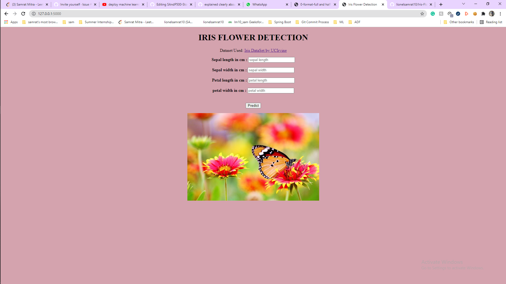
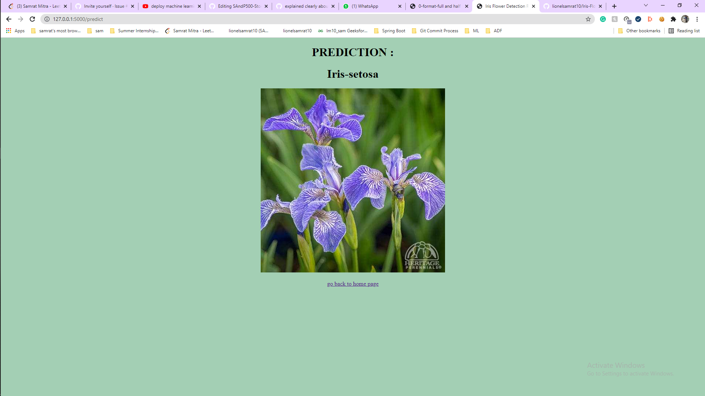

# Iris flower prediction web application

A real time web application, that is built using the University of California, Irvine presented Iris Dataset, which basically predicts three types of Iris flowers based on the length, width of the sepals and the petals.
There are three type of Iris flowers, that can be predicted: Iris Versicolor, Iris Setosa and Iris Virginica.Plesae ⭐ this repository if you found it useful.   

## Technologies Used:

* `Python`
* `Numpy`
* `Pandas`
* `Matplotlib`
* `Heroku for deploying our web application`
* `Git for Version Control` 

## Preview

### Installation :

Firstly Clone the Repository onto your local machine using the following command:

`git clone https://github.com/lionelsamrat10/Iris-Flower-Prediction-Machine-Learning-Web-App.git`

A good practice to start with a new project and use it, is to make a virtual enviornment for the particular project. Here is the steps for making virtual enviornment ::

1. `pip install virtualenv`
2. `python -m virtualenv myenv`

#### Install the dependencies of the App ::

Run commands on python terminal or anaconda terimial or any terminal you are using in your system.

* `pip install -r requirements.txt`

### Test :

* Run `python app.py`.
* The app will be up and running at the following URL `http://localhost:5000/`
* Now provide the length and width of the sepal and petal of the flowers (Which can be found in the Iris.data file) and then submit the values and the app will predict the flower with almost 100% accuracy.

### Deployed Version

* The app is deployed using heroku: [Click here](https://iris-flower-detection-samrat.herokuapp.com/)

Hope you like this project !!! 
